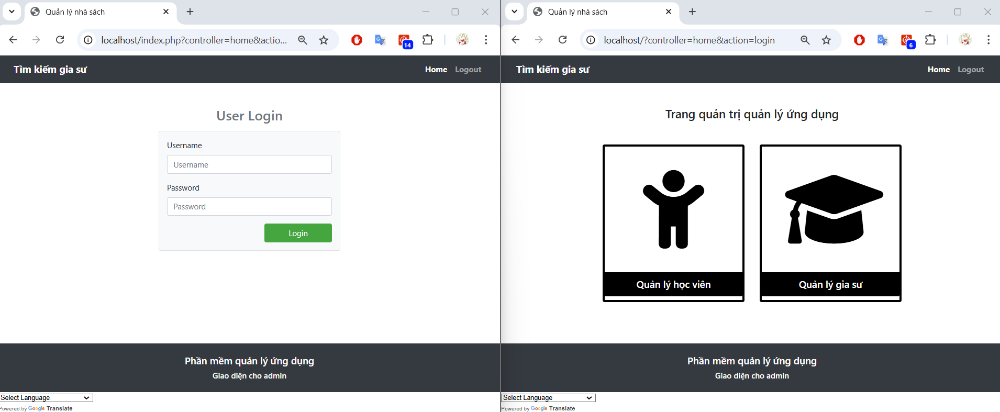
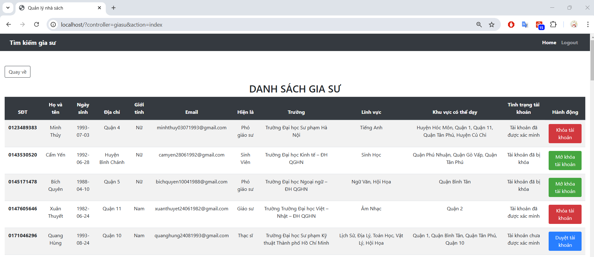
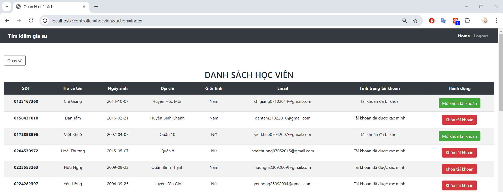

# Web service for StudentApp and TutorApp

Final project of "Mobile Apps Development" - Ton Duc Thang University  
Topic: The intermediary app facilitates the service of finding tutors  

Project includes 3 modules:  
- Application for student (Android Application) at: https://github.com/TUT888/StudentApp
- Application for tutor (Android Application) at: https://github.com/TUT888/TutorApp
- Web service at: https://github.com/TUT888/WebService-TutorApp

## Project Description
**This is the source code for web service of the project.** It includes:  
- Web service API for Android applications
- Basic user interface for database interaction (used by Admin)

## Installation
### Basic information
- The project use XAMPP to install localhost server.
- Database design and its initial data is stored in SQL script `giasuapp.sql`
- All files in this repo should be placed in `C:\xampp\htdocs` directory
- **The application uses Google Translate for automatic translation into other languages; therefore, there may be slight UI errors due to the translation**

### Step by step
1. Install XAMPP
2. Preparation:
  - Open terminal and to `htdocs` folder in your xampp directory, by default it should be `C:\xampp\htdocs`
    `cd C:\xampp\htdocs`
  - Clone this repository
    `git clone https://github.com/TUT888/WebService-TutorApp.git`
5. Setup
  - Open XAMPP, start Apache and MySQL
  - Open phpMyAdmin by clicking on `Admin` action of **MySQL module**
  - Click on `Import` on the toolbar, and import the `giasuap.sql` to initialize the database
6. Access the localhost server:
  - Open a browser and go to localhost with corresponding port, or click on `Admin` action of **Apache module**
7. Login with default account:
  - Username: admin
  - Password: 123456
8. At the bottom of the page, there is an option for Google Translate. Select a language for automatic translation.
9. Feel free to explore the features.

## Authors
The project has done by a group of 3 members:
- Uyen Tam Tat (Alice Tat): [Github](https://github.com/TUT888)
- Thuy Tien Duong: [Github](https://github.com/tienduong-21)
- Hieu San Truong: [Github](https://github.com/hs0512)

Original repository during development: [HST-backendStudentApp](https://github.com/hs0512/backendStudentApp)
